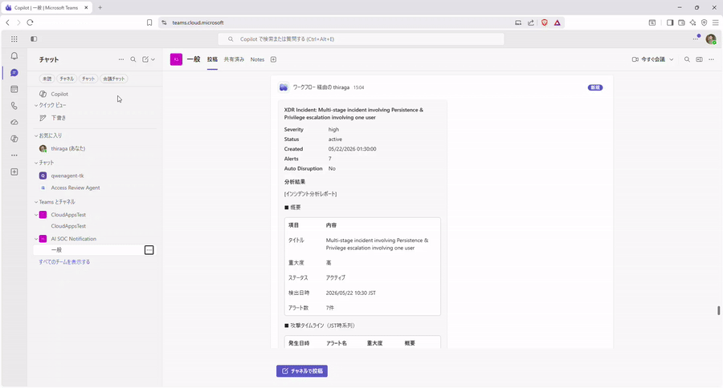

# XDR ディープ分析エージェント

Microsoft Defender XDR のインシデントを **自動で深掘り分析**し、結果を XDR インシデントコメントおよび Teams に投稿するモジュール。
データ収集と数値は KQL / Graph API で算出し、攻撃チェーン分析・MITRE ATT&CK マッピング・リスク評価などの分析については **Security Copilot Build Agent** が生成する。
アナリストは Teams カード上で **True Positive 確認** または **False Positive クローズ** を選択でき、判断結果や判断者のアサインが Defender ポータルのインシデント上に反映される。

## デモ：Teams への分析結果通知



## 前提条件（必要な製品・ライセンス）

| 製品 / サービス | 用途 | 備考 |
|---|---|---|
| **Microsoft Defender XDR**（統合 SOC） | 分析対象のインシデント・アラートの参照元、コメント／分類の書込先 | Microsoft Graph Security API 経由でアクセス |
| **Microsoft Sentinel**（Log Analytics ワークスペース） | エンティティ・サインイン異常・脅威インテリジェンスの KQL 集計対象 | Defender ポータルに統合済みのワークスペース |
| **Microsoft Security Copilot** | 攻撃チェーン分析・MITRE マッピング・リスク評価コメントの生成（Build Agent 実行） | SCU（Security Compute Unit）のプロビジョニングが必要 |
| **Azure Logic Apps**（従量課金） | 分析パイプラインのオーケストレーション（スケジュール実行） | マネージド ID で Graph / Monitor / Security Copilot に接続 |
| **Microsoft Teams**（任意） | 分析結果の通知と TP/FP 判定の受付（Adaptive Card） | 不要な場合は `teamsChannelLink` を空欄でスキップ |

> RBAC: デプロイ実行者には対象サブスクリプション／リソースグループへの **共同作成者**（リソース作成）が必要。
> Logic App のシステム割り当てマネージド ID には Microsoft Graph の **SecurityIncident.ReadWrite.All** / **SecurityAlert.ReadWrite.All** アプリロールを付与する。
> API コネクタの認可・Agent 登録には Sentinel / Security Copilot 側の相応の権限が必要。

## 本リポジトリの構成ファイル

| ファイル | 役割 |
|---|---|
| [XDRDeepDiveAgent.yaml](XDRDeepDiveAgent.yaml) | Security Copilot の Agent 定義 |
| [logicapp-xdr-deepanalysis.json](logicapp-xdr-deepanalysis.json) | ARM テンプレート。接続／Logic App を作成。以降 Logic App で分析を実行（Graph 取得 → KQL 集計 → Agent → XDR コメント／Teams 投稿） |

## データフロー

```
Logic App（スケジュール実行：平日 9/11/13/15/17 時 JST）
 ├─ Graph_list_incidents   status=active / 遡り時間 / 新着順でインシデント取得（最大 50 件）
 ├─ Filter_unprocessed     未処理 + minSeverity 以上 + 自動かく乱済み除外 + correlationWaitMinutes 経過で足切り（SCU 削減）
 ├─ ForEach_incident       先頭から maxIncidentsPerRun 件のみ処理
 │   ├─ Graph_get_alerts        アラート詳細を取得
 │   ├─ KQL_incident_entities   エンティティ・MITRE マッピングを集計（最大 30 行）
 │   ├─ KQL_signin_anomalies    サインイン異常を集計（最大 20 行）
 │   ├─ KQL_ti_matches          脅威インテリジェンスマッチを集計（最大 20 行）
 │   ├─ Compose_analysis_prompt 軽量化したデータをプロンプトに圧縮して入力トークンを削減
 │   ├─ SecurityCopilot_analyze 統合分析を Security Copilot Agent へ送り分析
 │   ├─ Graph_post_comment      分析結果を XDR インシデントコメントに投稿
 │   ├─ Graph_add_tag           DeepAnalysisComplete タグを付与（重複分析を防止）
 │   └─ Condition_teams_post    （任意）Teams に Adaptive Card で通知
 │       ├─ True Positive として確認  → TP 分類・担当者割当・コメント
 │       └─ False Positive としてクローズ → FP クローズ
```

## 展開手順

### Phase 1: Build Agent の登録

最新手順は公式手順を参照ください [Build Security Copilot agents by uploading a YAML](https://learn.microsoft.com/copilot/security/developer/build-agent-yaml-file#steps-to-build-and-upload-the-yaml)

1. [Security Copilot](https://securitycopilot.microsoft.com/) を開き、**ビルド** メニューで **YAML マニフェストのアップロード** 配下の **アップロード** を選択し、[XDRDeepDiveAgent.yaml](XDRDeepDiveAgent.yaml) をアップロード。
2. アップロード後、エージェントビルダーにマニフェストの構成（Tools / エージェント概要）が表示される。
3. 内容を確認し（必要なら概要などを調整）、エージェントを発行する。
4. **エージェント** メニューで表示されている **UXDRDeepDiveAgent.yaml** の設定からサインインを行う。

### Phase 2: モジュールのデプロイ

**A. ARM テンプレートのデプロイ** — 最新手順は公式手順を参照ください [Deploy resources from custom template](https://learn.microsoft.com/azure/azure-resource-manager/templates/deploy-portal#deploy-resources-from-custom-template)

1. [Azure Portal](https://portal.azure.com/) の検索バーで **Deploy a custom template**（カスタム テンプレートのデプロイ）を検索して選択。
2. **Build your own template in the editor**（エディターで独自のテンプレートを作成する）を選択。
3. **ファイルの読み込み** で [logicapp-xdr-deepanalysis.json](logicapp-xdr-deepanalysis.json) を読み込む（または内容を貼り付け）→ **保存**。
4. パラメータ入力画面で **リソースグループ** を選び、各パラメータに**自組織のニーズに応じた値を入力する**（下記の必須／推奨項目を参照）→ **確認と作成**。
   - `tenantId` / `sentinelSubscriptionId` / `sentinelResourceGroupName` / `sentinelWorkspaceName`: 集計対象の Sentinel（Log Analytics）ワークスペースを指定（**必須・既定なし**）。
   - `teamsChannelLink`: Teams 通知を使う場合に指定。メッセージを投稿したいチャネルの **「リンクをコピー」** でコピーした URL を貼り付ける（チャネル ID / チーム ID は Logic App が自動抽出。詳細は下記「[Teams チャネルリンクの取得](#teams-チャネルリンクの取得)」を参照）。不要なら空欄のままにすると Teams 投稿をスキップ。
   - `minSeverity`: SC 分析を実行する最低重大度。**SCU 消費を抑えたい場合は `high` 推奨**（[IaC パラメータ](#iac-パラメータ)参照）。
   - `correlationWaitMinutes` / `maxIncidentsPerRun`: 相関待機と 1 回あたりの処理件数を運用に合わせて調整。
   - その他の既定値で問題なければそのままで可。
5. 検証通過後 **作成**。必要なリソースが一括作成される。

> パラメータの全一覧と各既定値の根拠は下記「[IaC パラメータ](#iac-パラメータ)」を参照。

#### Teams チャネルリンクの取得

`teamsChannelLink` には、対象チャネルの **リンク（URL）をそのまま** 貼り付ける（URL デコードや ID の手動抽出は不要）。

1. [Teams](https://teams.microsoft.com/) で投稿先チャネルの **「…」（その他のオプション）** > **チャネルへのリンクを取得** を選択し、リンクをコピーする。
2. コピーした URL をそのまま `teamsChannelLink` に貼り付ける。URL は次の形式で、Logic App がチャネル ID（`19:...@thread.tacv2`）とチーム ID（`groupId` の GUID）を自動抽出・デコードする。

   ```
   https://teams.microsoft.com/l/channel/19%3Axxxxxxxx%40thread.tacv2/<チャネル名>?groupId=00000000-0000-0000-0000-000000000000&tenantId=...
   ```

**B. コネクタの認可**

1. 作成された Logic App `la-xdr-deepanalysis` > **API 接続**で `securitycopilot` / `azuresentinel` / `azuremonitorlogs` / `teams`（Teams 利用時）> API 接続の編集 を開き、**Authorize（承認する）** で認可を完了したあと、**保存**。
2. 各コネクタは対象リソースへの適切な権限（Sentinel Responder 等）を持つアカウントで認可する。

**C. マネージド ID への Graph API 権限付与**

Logic App のシステム割り当てマネージド ID に、Microsoft Graph Security の読み書き権限（`SecurityIncident.ReadWrite.All` / `SecurityAlert.ReadWrite.All`）を付与する。

**手順 1: Principal ID を確認（Portal GUI）**

[Azure Portal](https://portal.azure.com/) で作成した Logic App `la-xdr-deepanalysis` > **設定** > **ID（Identity）** > **システム割り当て済み** タブを開き、**オブジェクト (プリンシパル) ID** をコピーする。

**手順 2: 権限を付与（PowerShell）**

```powershell
# 手順 1 でコピーした オブジェクト (プリンシパル) ID を貼り付け
$principalId = "<LOGIC_APP_MANAGED_IDENTITY_PRINCIPAL_ID>"

# Microsoft Graph に接続（権限付与に必要なスコープで同意）
Connect-MgGraph -Scopes "Application.ReadWrite.All", "AppRoleAssignment.ReadWrite.All"

# Microsoft Graph の well-known App ID（全テナント共通の固定値）
$graphAppId = "00000003-0000-0000-c000-000000000000"

# Microsoft Graph のサービスプリンシパルを取得
$graphSP = Get-MgServicePrincipal -Filter "appId eq '$graphAppId'"

# 必要なアプリロール
$roles = @(
  "SecurityIncident.ReadWrite.All",
  "SecurityAlert.ReadWrite.All"
)

foreach ($roleName in $roles) {
  $role = $graphSP.AppRoles | Where-Object { $_.Value -eq $roleName }
  New-MgServicePrincipalAppRoleAssignment `
    -ServicePrincipalId $principalId `
    -PrincipalId $principalId `
    -ResourceId $graphSP.Id `
    -AppRoleId $role.Id
}
```

> `Microsoft.Graph` PowerShell モジュールが必要。`Install-Module Microsoft.Graph -Scope CurrentUser` でインストールする。
> 付与には **特権ロール管理者（Privileged Role Administrator）** 以上の権限を持つアカウントで `Connect-MgGraph` にサインインする必要がある。

### Phase 3: 通常運用（スケジュール実行）

設定された頻度（既定では平日 9:00 / 11:00 / 13:00 / 15:00 / 17:00 JST）で未分析インシデントを集計・分析し、結果を XDR コメントおよび Teams に出力する。

## 技術仕様

### IaC パラメータ

| param | 既定 | 説明 |
|---|---|---|
| `tenantId` | （必須・既定なし） | Azure AD テナント ID。デプロイ環境に合わせて指定 |
| `sentinelSubscriptionId` | （必須・既定なし） | 対象 Sentinel ワークスペースのサブスクリプション ID |
| `sentinelResourceGroupName` | （必須・既定なし） | 対象 Sentinel ワークスペースのリソースグループ名 |
| `sentinelWorkspaceName` | （必須・既定なし） | 対象の Log Analytics（Sentinel）ワークスペース名 |
| `logicAppName` | `la-xdr-deepanalysis` | 作成する Logic App 名 |
| `location` | `[resourceGroup().location]` | リソース作成先リージョン |
| `recurrenceIntervalMinutes` | `30` | 実行間隔（分） |
| `maxIncidentsPerRun` | `1` | 1 回あたりの処理インシデント数（SCU 消費制御）。フィルタ後の先頭 N 件のみ処理 |
| `minSeverity` | `medium` | 分析を実行する最低重大度。これ未満は SC 分析をスキップ（`informational` / `low` / `medium` / `high`）。**SCU が厳しい場合は `high` 推奨** |
| `correlationWaitMinutes` | `30` | **オプション**。インシデント作成からこの分数経過後に分析。相関完了前の不完全分析・重複分析による SCU 二重消費を防止 |
| `incidentLookbackHours` | `2` | インシデント検索の遡り時間（時間） |
| `teamsChannelLink` | `""` | **オプション**。Teams チャネルの「チャネルへのリンクを取得」で取得した URL。チャネル ID / チーム ID は Logic App が自動抽出。空の場合 Teams 投稿をスキップ。取得方法は [Teams チャネルリンクの取得](#teams-チャネルリンクの取得) を参照 |
| `outputLanguage` | `Japanese` | 分析結果の出力言語（`English` / `Japanese`） |

> `tenantId` / `sentinelSubscriptionId` / `sentinelResourceGroupName` / `sentinelWorkspaceName` は**既定値を持たない必須パラメータ**。デプロイ時に自組織の値を必ず指定すること。

## エージェントの呼び出し方式について

本ソリューションでは、Security Copilot コネクタの [Submit a Security Copilot prompt](https://learn.microsoft.com/connectors/securitycopilot/) アクションで、依頼文（プロンプト）の中で役割を伝えてエージェントを呼び出す方式を採用しています。Security Copilot には、[Execute a Security Copilot Agent](https://learn.microsoft.com/copilot/security/connector-logicapp-agent-trigger) コネクタでエージェントを名前で直接指定して呼び出す新方式もあります。新方式は将来性のある選択肢ですが、利用条件や環境ごとの個別設定が必要になる可能性、配布テンプレートとしての扱いやすさ、コスト（SCU）面での効果など、不確実な要素が残ります。これらのリスクを見越し、本ソリューションでは安定して利用できる現行方式を採用しています。

## ライセンス

 [MIT License](LICENSE)
